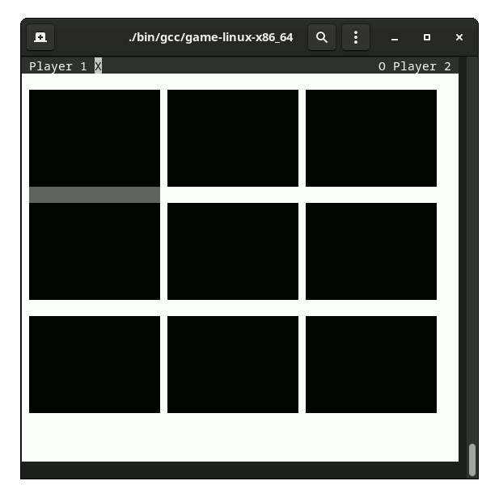

## About
This is a simple game engine that was built to run bare-metal on a Raspberry Pi 3.
Using the Raspberry Pi's UART hardware, the games can be played through a serial terminal, and create colored text graphics with ANSI codes. 

The engine was architected with platform-specific details (timer, terminal) abstracted out so it could also
be implemented and compiled for desktop, which is easier to test and debug.
The platform-specific dependencies are injected in [`main.c`](source/main.c) based on compiler flags.

## Demo
A menu and two games are included as examples, controlled using the WASD and Space keys.

  
<b>Menu</b> (Epilepsy warning: has cycling colors)

  

  
<b>Snake</b>

  

  
<b>Tic-Tac-Toe</b>

  

## Design

  
Architecture Diagram

  

  
Sequence Diagram

  

## Building

Building can be done with `make raspi3`, or `make gcc` for desktop. Making raspi3 requires the Linaro arm-none-eabi-g++ cross compilation toolchain.
